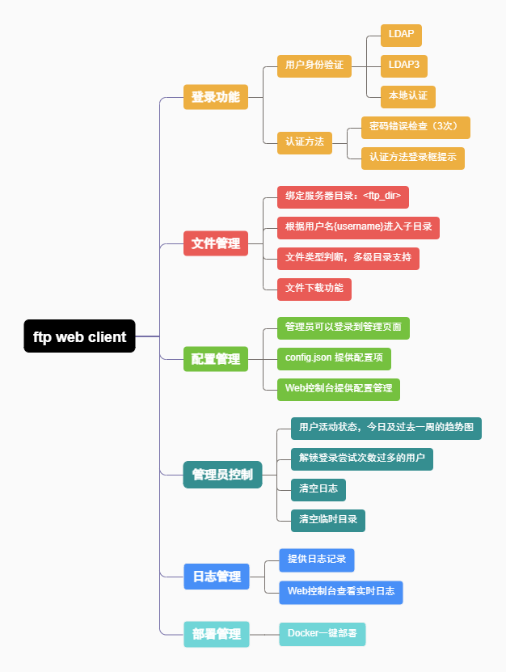
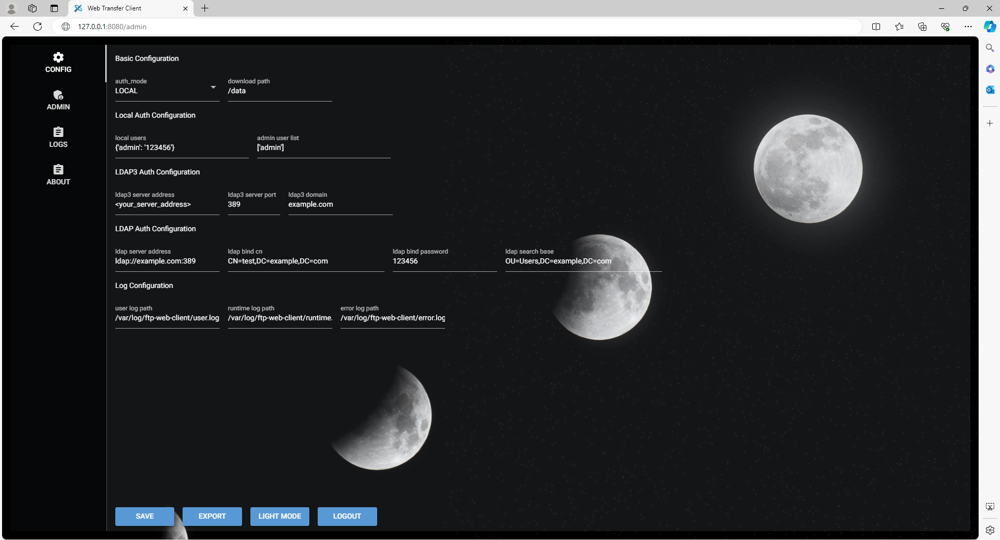

<div align="center">
      
</div>

# FTP Web Client 

`Ftp Web Client`是 FTP 的 Web 层实现，提供基于 Microsoft AD 的身份验证以及绑定到 FTP 用户目录的基于 Web 的下载功能。 开发者： [levywang](https://github.com/levywang/).



[](https://github.com/levywang/ftp-web-client "Click to view the repo on Github")
[](https://github.com/levywang/ftp-web-client/releases/latest "Click to view the repo on Github")
[](https://github.com/levywang/ftp-web-client "Click to view the repo on Github")
[](https://github.com/levywang/ftp-web-client "Click to view the repo on Github")
[](https://github.com/levywang/ftp-web-client "Click to view the repo on Github")
[](https://github.com/levywang/ftp-web-client/issue "Click to view the repo on Github")


[](https://hub.docker.com/r/levywang/ftp-web-client "Click to view the image on Docker Hub")
[](https://hub.docker.com/r/levywang/ftp-web-client "Click to view the image on Docker Hub")
[](https://hub.docker.com/r/levywang/ftp-web-client "Click to view the image on Docker Hub")

## Star 趋势

[](https://starchart.cc/levywang/ftp-web-client)

[English](README.md) | [简体中文](README-zh_CN.md) 

## About The Project


### Demo
URL：[http://ftp.wwlww.org](http://ftp.wwlww.org)
- Username：admin
- Password：123456

### 主要功能

- 完整的登录功能，支持使用 python-ldap3、python-ldap 库以及本地身份验证。
- 提供用户下载功能，默认绑定用户目录，可以选择绑定Linux主目录或FTP目录，也可以灵活设置其他目录。
- 后端管理功能包括全面的配置管理、日志管理和控制面板。

### Todo list

- [ ] SSH 协议认证
- [ ] FTP 协议认证
- [ ] 上传功能
- [ ] 多语言支持

### 国际化

- English

我们欢迎翻译成任何语言。


## 入门

### 使用前

使用此项目之前，需要根据实际情况修改 `web_admin.py` 和 `config.json` 文件。

如果需要修改运行端口，在 `web_admin.py` 的最后一行。

默认情况下，使用端口 8080。

`<config_bind_data_dir>` 的默认值为 `/data`

`<your_local_dir>` 可以设置 ftp 绑定目录或 `/home`


当您的服务运行时，使用 `http://<your_server_ip>:8080` 登录到 Web 面板。

### 安装

ftp-web-client 可在以下平台上使用：

- macOS 11 Big Sur and later (amd64 / arm64)
- Linux 2.6.23 and later (x86 / amd64 / arm64 / armv5 / armv6 / armv7)
  - Including but not limited to Debian 7 / 8, Ubuntu 12.04 / 14.04 and later, CentOS 6 / 7, Arch Linux
- FreeBSD
- OpenBSD
- Dragonfly BSD
- Openwrt

### 使用方法

项目第一次运行时，需要编辑项目根目录下的 `config.json` 文件。

#### 命令行运行

```bash

git clone https://github.com/levywang/ftp-web-client.git
cd ftp-web-client
pip install -r requirements.txt
python web_admin.py
```

#### Docker
我们的 docker 镜像 [levywang/ftp-web-client:latest](https://hub.docker.com/r/levywang/ftp-web-client) 基于最新的 python 镜像。

##### 注意
1. 使用前请绑定本地用户目录（或者其他）到容器中，默认容器目录是 `/data`。
2. 如果要托管静态文件，可以将目录映射到容器。

<details>
<summary><b>Deploy with Docker</b></summary>

1. [安装 Docker.](https://docs.docker.com/install/)

2. 然后运行 Docker 容器:

```bash
docker run -dit \
  --name=ftp-web-client \
  --restart=always \
  -e TZ=Asia/Shanghai \
  -v <your_local_dir>:<config_bind_data_dir> \
  -p 8080:8080 \
  levywang/ftp-web-client:latest
```

3. 当您的 docker 容器运行时，使用以下 url 登录到 Web 面板 `http://<your_server_ip>:8080`.
</details>

<details>
<summary><b>Deploy with Docker-Compose</b></summary>

1. [Install Docker-Compose.](https://docs.docker.com/compose/install/)

2. 创建一个 docker-compose.yml 文件，内容如下:

```yml
version: '3.3'
services:
    ftp-web-client:
        stdin_open: true
        tty: true
        container_name: ftp-web-client
        restart: always
        environment:
            - TZ=Asia/Shanghai
        volumes:
            - '<your_local_dir>:<config_bind_data_dir>'
        ports:
            - 8080:8080
        image: 'levywang/ftp-web-client:latest'
```

3. 使用下面命令运行容器:

```bash
docker-compose up -d
```

```bash
# 如果使用的是 docker 原生 compose 插件
docker compose up -d
```

4. 当您的 docker 容器运行时，使用以下 url 登录到 Web 面板 `http://<your_server_ip>:8080`.

</details>

<details>
<summary><b>Build Local Dockerfile</b></summary>

```bash
# Build Docker Image
docker build -t <tag>:<version> .

# RUN Docker Container
docker run -d --name <container_name> -v <your_path>:<container_path> -p <your_port>:8080 <tag>:<version>
```
</details>

## License
This project is provided under a GNU Affero General Public License v3.0 license that can be found in the [LICENSE](LICENSE) file. By using, distributing, or contributing to this project, you agree to the terms and conditions of this license.
