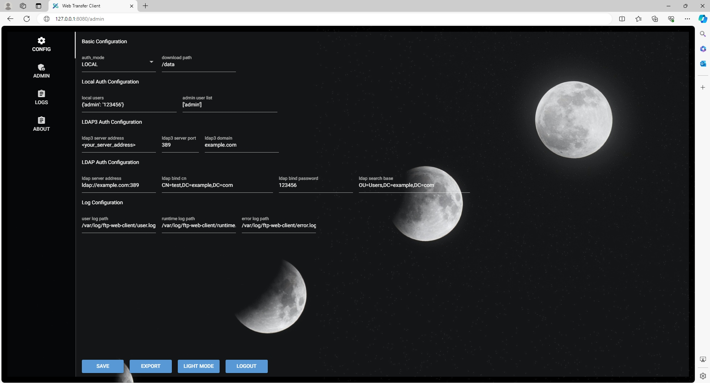

<div align="center">
      
</div>

# FTP Web Client 

`Ftp Web Client` is the web layer implementation of FTP, providing authentication based on Microsoft AD and web-based download functionality bound to FTP user directories. developed by [levywang](https://github.com/levywang/).


[](https://github.com/levywang/ftp-web-client "Click to view the repo on Github")
[](https://github.com/levywang/ftp-web-client/releases/latest "Click to view the repo on Github")
[](https://github.com/levywang/ftp-web-client "Click to view the repo on Github")
[](https://github.com/levywang/ftp-web-client "Click to view the repo on Github")
[](https://github.com/levywang/ftp-web-client "Click to view the repo on Github")
[](https://github.com/levywang/ftp-web-client/issue "Click to view the repo on Github")


[](https://hub.docker.com/r/levywang/ftp-web-client "Click to view the image on Docker Hub")
[](https://hub.docker.com/r/levywang/ftp-web-client "Click to view the image on Docker Hub")
[](https://hub.docker.com/r/levywang/ftp-web-client "Click to view the image on Docker Hub")

## Stargazers over time

[](https://starchart.cc/levywang/ftp-web-client)

[English](README.md) | [简体中文](README-zh_CN.md) 

## About The Project


### Demo
URL：[http://ftp.wwlww.org](http://ftp.wwlww.org)
- Username：admin
- Password：123456

### Features

- Complete login functionality, supporting local authentication using python-ldap3 and python-ldap libraries.
- Provides user download functionality, defaulting to binding user directories, with options to bind to Linux home directories or FTP directories, and the flexibility to set other directories as well.
- Backend administrative features include comprehensive configuration management, log management, and a control panel.

### Todo list

- [ ] SSH Protocol Authentication
- [ ] FTP Protocol Authentication
- [ ] Upload function
- [ ] Multi-language support

### Internationalization

- English

We welcome translations into any language.

## Getting Started

### Before Use

Before using this item, you need to modify the web_admin.py and config.json files according to the actual situation.

If you need to modify the running port, it is in the last line of web_admin.py. 

By default, port 8080 is used.

The default value of `<config_bind_data_dir>` is `/data`

`<your_local_dir>` can set the ftp binding directory or `/home`


When your service is running, Log in to web panel with `http://<your_server_ip>:8080`.

### Installation

ftp-web-client is available on the following platforms:

- macOS 11 Big Sur and later (amd64 / arm64)
- Linux 2.6.23 and later (x86 / amd64 / arm64 / armv5 / armv6 / armv7)
  - Including but not limited to Debian 7 / 8, Ubuntu 12.04 / 14.04 and later, CentOS 6 / 7, Arch Linux
- FreeBSD
- OpenBSD
- Dragonfly BSD
- Openwrt

### Usage

In the first runtime of the project, you need to edit the `config.json` file in the root directory of the project.

#### From Executable
**Run Project in Terminal**

```bash

git clone https://github.com/levywang/ftp-web-client.git
cd ftp-web-client
pip install -r requirements.txt
python web_admin.py
```

#### With Docker
Our docker image [levywang/ftp-wecb-client:latest](https://hub.docker.com/r/levywang/ftp-web-client) is based on the latest python image.

##### Note
1. Please bind the local user directory (or other) to the container before use. The default container directory is `/data`.
2. If you want to host static files, you can map directories to container.

<details>
<summary><b>Deploy with Docker</b></summary>

1. [Install Docker.](https://docs.docker.com/install/)

2. Then deploy ftp-web-client like this:

```bash
docker run -dit \
  --name=ftp-web-client \
  --restart=always \
  -e TZ=Asia/Shanghai \
  -v <your_local_dir>:<config_bind_data_dir> \
  -p 8080:8080 \
  levywang/ftp-web-client:latest
```

3. When your docker container is running, Log in to web panel with `http://<your_server_ip>:8080`.
</details>

<details>
<summary><b>Deploy with Docker-Compose</b></summary>

1. [Install Docker-Compose.](https://docs.docker.com/compose/install/)

2. Create a docker-compose.yml file like this:

```yml
version: '3.3'
services:
    ftp-web-client:
        stdin_open: true
        tty: true
        container_name: ftp-web-client
        restart: always
        environment:
            - TZ=Asia/Shanghai
        volumes:
            - '<your_local_dir>:<config_bind_data_dir>'
        ports:
            - 8080:8080
        image: 'levywang/ftp-web-client:latest'
```

3. Then creat your container by:

```bash
docker-compose up -d
```

```bash
# If using docker-compose-plugin
docker compose up -d
```

4. When your docker container is running, Log in to web panel with `http://<your_server_ip>:8080`.

</details>


<details>
<summary><b>Build Local Dockerfile</b></summary>

```bash
# Build Docker Image
docker build -t <tag>:<version> .

# RUN Docker Container
docker run -d --name <container_name> -v <your_path>:<container_path> -p <your_port>:8080 <tag>:<version>
```
</details>


## License
This project is provided under a GNU Affero General Public License v3.0 license that can be found in the [LICENSE](LICENSE) file. By using, distributing, or contributing to this project, you agree to the terms and conditions of this license.
